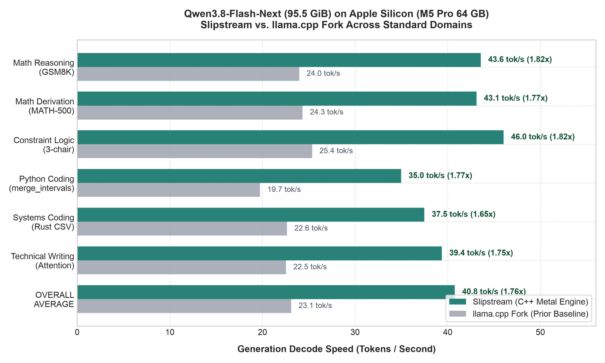
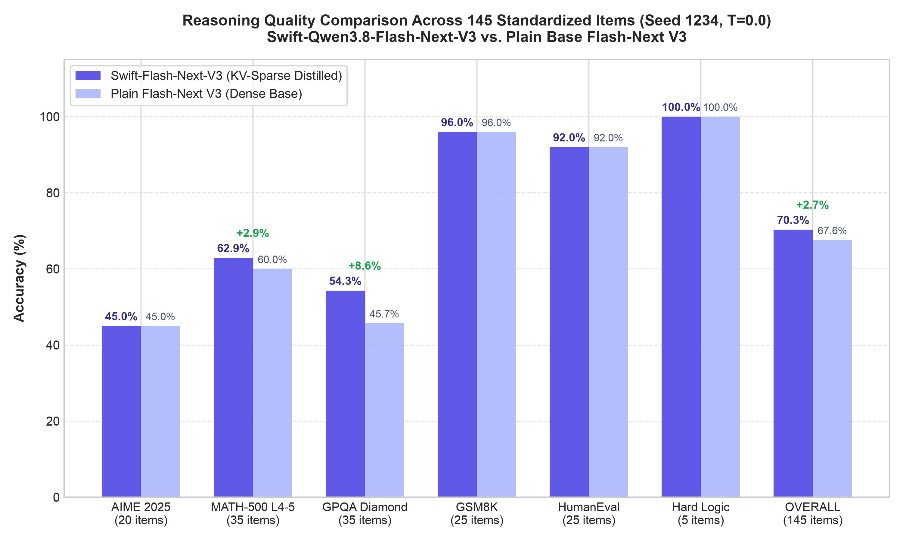
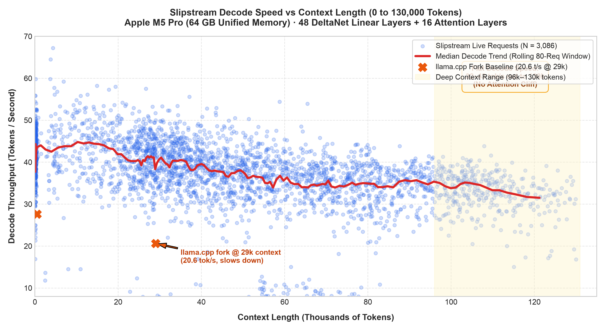

# Slipstream

**Run 95.5 GiB Qwen3.8-Flash-Next on a single 64 GB Mac at 41–52 tok/s.**

Slipstream is a lean, high-performance C++ and Metal inference engine built specifically for Apple Silicon. It combines **SSD expert streaming** with **predictive read-ahead** and **Prompt Lookup + MTP speculative drafting** to serve frontier-scale models that exceed your Mac's physical RAM.

It serves **Qwen3.8-Flash-Next V3** (125.7B parameters, 512 routed experts, 7.3B active per token) and its **Swift KV-sparse variant** at **1.76x the speed of llama.cpp**, with context scaling tested all the way out to **130,000 tokens without decode collapse**.

Everything is open source under Apache-2.0.

---

## Why Qwen3.8-Flash-Next V3?

| Model Variant | HF Checkpoint (GGUF) | Active / Total Weights | Reasoning (Scorecard) | Peak Speed | RAM Needed |
|---|---|---:|---:|---:|---:|
| **Swift-Flash-Next V3** *(Recommended)* | [nitinpanj/Swift-Qwen3.8-Flash-Next-Q4_0-Q8out-v3-GGUF](https://huggingface.co/nitinpanj/Swift-Qwen3.8-Flash-Next-Q4_0-Q8out-v3-GGUF) | 7.3B / 125.7B | **70.3%** (GPQA 54.3%, MATH 62.9%) | **41–52 tok/s** | 64 GB Mac |
| **Plain Flash-Next V3** | [nitinpanj/Qwen3.8-Flash-Next-Q4_0-Q8out-v3-GGUF](https://huggingface.co/nitinpanj/Qwen3.8-Flash-Next-Q4_0-Q8out-v3-GGUF) | 7.3B / 125.7B | **67.6%** (GPQA 45.7%, MATH 60.0%) | **40–48 tok/s** | 64 GB Mac |

- **Frontier Reasoning on a Laptop:** Outperforms standard 27B dense models on GPQA Diamond (54.3% vs 45.7%) and MATH-500 (62.9% vs 60.0%), with 92% on HumanEval and 96% on GSM8K.
- **Fast Generation:** 41–52 tok/s sustained decode on an M5 Pro (64 GB).
- **No Context Collapse:** Maintains 32–43 tok/s out to 130,000 tokens thanks to 48 recurrent linear DeltaNet layers ($O(1)$ state growth) and only 16 full-attention layers.
- **KV-Sparsity (Swift):** The Swift variant incorporates KV-sparse attention distilled from Swift-1.5 with spliced Q8 donor backbones, minimizing RAM growth in long agent sessions.

---

## Quickstart (Step-by-Step)

### Prerequisites
- **Hardware:** Apple Silicon Mac with **64 GB Unified Memory** (M2/M3/M4/M5 Pro/Max).
- **Disk:** ~100 GB for the multi-shard GGUF weights + ~95 GB working disk space.
- **macOS:** macOS 15.0+ with Command Line Tools or Xcode installed (`xcode-select --install`).

---

### Step 1: Clone & Build Slipstream

```zsh
git clone https://github.com/npanj/slipstream.git
cd slipstream
make -j4
```
*Note: `make` compiles the native C++ runtime and Metal compute kernels into `build/slipstream` and `build/slipstream.metallib` in under a minute.*

---

### Step 2: Download the Model

We recommend the **Swift KV-sparse variant** for optimal reasoning accuracy and lower KV memory footprint:

```zsh
# Recommended: Swift-Qwen3.8-Flash-Next V3 (95.5 GiB)
huggingface-cli download nitinpanj/Swift-Qwen3.8-Flash-Next-Q4_0-Q8out-v3-GGUF \
    --local-dir ~/models/swift-qwen38-flash-next-v3

# Or download with fast parallel transfer if hf_transfer is installed:
HF_HUB_ENABLE_HF_TRANSFER=1 huggingface-cli download nitinpanj/Swift-Qwen3.8-Flash-Next-Q4_0-Q8out-v3-GGUF \
    --local-dir ~/models/swift-qwen38-flash-next-v3
```

*(Alternative: If you prefer the plain dense base model without Swift KV-sparsity:)*
```zsh
huggingface-cli download nitinpanj/Qwen3.8-Flash-Next-Q4_0-Q8out-v3-GGUF \
    --local-dir ~/models/qwen38-flash-next-v3
```

---

### Step 3: Raise GPU Memory Limit (One-Time per Boot)

On 64 GB Macs, macOS defaults the wired GPU limit to ~48 GiB. Raise it to 58 GiB so the SSD expert cache and KV pool have ample headroom:

```zsh
sudo sysctl iogpu.wired_limit_mb=59392
```

---

### Step 4: Serve the Model

Point `./slipstream serve` directly at the downloaded model directory:

```zsh
./slipstream serve --model ~/models/swift-qwen38-flash-next-v3 --port 8090
```

> **First Run Note:** On first launch, Slipstream detects the multi-shard GGUF files and prepares optimized streaming package files into `<model-dir>/prepared/` (~5–7 minutes). Subsequent launches load in **~10–15 seconds**.

---

### Step 5: Connect Your Tools & Clients

The server provides a standard OpenAI-compatible API on `http://127.0.0.1:8090`:

#### curl
```zsh
curl -s http://127.0.0.1:8090/v1/chat/completions \
  -H "Content-Type: application/json" \
  -d '{
    "model": "local/swift-qwen38-flash-next-v3",
    "messages": [
      {"role": "user", "content": "Write a clean, optimal Python function for interval merging."}
    ],
    "temperature": 0.0
  }'
```

#### Python (OpenAI SDK)
```python
from openai import OpenAI

client = OpenAI(base_url="http://127.0.0.1:8090/v1", api_key="not-needed")

response = client.chat.completions.create(
    model="local/swift-qwen38-flash-next-v3",
    messages=[{"role": "user", "content": "Explain multi-head self-attention with linear algebra."}],
    temperature=0.0,
)
print(response.choices[0].message.content)
```

#### Oh My Pi (omp) & Coding Agents
```zsh
# Launch omp connected directly to Slipstream
omp --model splash-flashnext/local/swift-qwen38-flash-next-v3 \
    --tools=read,write,edit,bash,grep,glob,todo \
    --thinking=low --approval-mode=yolo
```

---

## Benchmarks & Performance

### 1. Head-to-Head: llama.cpp Fork vs. Slipstream
*Evaluated on Apple MacBook M5 Pro (64 GB Unified Memory, Temperature 0.0):*

| Task Domain | Benchmark / Prompt | llama.cpp Fork | Slipstream | Speedup | llama.cpp TTFT | Slipstream TTFT |
|---|---|---:|---:|---:|---:|---:|
| **Math Reasoning** | GSM8K (eggs derivation) | 24.0 tok/s | **43.6 tok/s** | **1.82x** | 4,024 ms | **2,337 ms** |
| **Math Derivation** | MATH-500 series ($p - q$) | 24.3 tok/s | **43.1 tok/s** | **1.77x** | 1,655 ms | **1,587 ms** |
| **Constraint Logic** | 3-chair deduction | 25.4 tok/s | **46.0 tok/s** | **1.81x** | 1,469 ms | **1,042 ms** |
| **Python Coding** | `merge_intervals` ($O(N \log N)$) | 19.7 tok/s | **35.0 tok/s** | **1.77x** | 1,507 ms | **1,070 ms** |
| **Systems Coding** | Rust CSV parser | 22.7 tok/s | **37.5 tok/s** | **1.65x** | 1,257 ms | **859 ms** |
| **Tech Communication** | Multi-head attention | 22.5 tok/s | **39.4 tok/s** | **1.75x** | 1,267 ms | **843 ms** |
| **OVERALL AVERAGE** | Across all 6 domains | **23.1 tok/s** | **40.8 tok/s** | **1.76x** | **1,863 ms** | **1,290 ms** |



---

### 2. Reasoning Accuracy: Swift V3 vs. Plain Base V3
*Evaluated across 145 standardized items under memory guard (Seed 1234, T=0.0):*

| Benchmark | Items | Plain Flash-Next V3 | Swift-Flash-Next V3 | Accuracy Delta |
|---|---:|---:|---:|---:|
| **AIME 2025** | 20 | 45.0% (9/20) | **45.0% (9/20)** | 0.0% |
| **MATH-500 (L4–5)** | 35 | 60.0% (21/35) | **62.9% (22/35)** | **+2.9%** |
| **GPQA Diamond** | 35 | 45.7% (16/35) | **54.3% (19/35)** | **+8.6%** |
| **GSM8K** | 25 | 96.0% (24/25) | **96.0% (24/25)** | 0.0% |
| **HumanEval** | 25 | 92.0% (23/25) | **92.0% (23/25)** | 0.0% |
| **Hard Logic** | 5 | 100.0% (5/5) | **100.0% (5/5)** | 0.0% |
| **OVERALL SCORECARD** | **145** | **67.6% (98/145)** | **70.3% (102/145)** | **+2.8%** |



---

### 3. Context Scaling: Live Telemetry to 130,000 Tokens
*Measured across 3,086 live agent requests on Apple Silicon (M5 Pro 64 GB):*

| Context Range (Tokens) | Live Runs | Average Decode | Median Decode (p50) | Peak Decode | Avg TTFT |
|---|---:|---:|---:|---:|---:|
| **< 1,000** | 314 | **41.5 tok/s** | 41.9 tok/s | 59.8 tok/s | 2.16 s |
| **1k – 4,000** | 21 | **41.0 tok/s** | 42.5 tok/s | 64.5 tok/s | 5.26 s |
| **4k – 8,000** | 58 | **43.6 tok/s** | 43.2 tok/s | 67.2 tok/s | 7.36 s |
| **8k – 16,000** | 117 | **43.6 tok/s** | 44.6 tok/s | 58.2 tok/s | 7.91 s |
| **16k – 32,000** | 562 | **38.2 tok/s** | 40.9 tok/s | 58.0 tok/s | 13.59 s |
| **32k – 64,000** | 1,029 | **35.0 tok/s** | 37.5 tok/s | 55.6 tok/s | 13.24 s |
| **64k – 96,000** | 650 | **32.4 tok/s** | 34.7 tok/s | 53.9 tok/s | 12.81 s |
| **96k – 130,000** | 364 | **32.9 tok/s** | 33.3 tok/s | 43.8 tok/s | 7.95 s |



---

## Foundation for Qwen4

The core primitives implemented in Slipstream:
- 512-route sparse MoE streaming with predictive read-ahead
- Quasi-Sparse Attention (QSA) indexer and selection kernels
- Hyper-connection mixing and per-layer embedding gathers
- Metal GPU-mapped n-gram tables
- Single-lane speculative verification with Prompt Lookup Decoding (PLD) + Multi-Token Prediction (MTP)

...were engineered to match the upcoming model generation. Assuming **Qwen4** follows Flash-Next's architectural blueprint (hybrid linear recurrence + sparse attention + routed MoE experts), Slipstream can serve as a direct template to run Qwen4 locally on Apple Silicon on day one.

---

## Call for Porting Partners: NVIDIA (CUDA) & AMD (ROCm)

- **Current Status:** Tested exclusively on an **Apple MacBook Pro (M5 Pro, 64 GB Unified Memory)**.
- **Porting:** Because I do not have access to modern NVIDIA (CUDA) or AMD (ROCm) GPU hardware, I cannot build and test those backends myself.
- **Collaboration Offer:** If anyone in the community has hardware available and wants to bring these expert-streaming and speculative decoding gains to CUDA or ROCm, **I am happy to collaborate and help with the port**. Open an issue or reach out!

---

## Credits & Acknowledgments

- **Splash Team (Incoai)**: Full credit to the creators of Splash ([github.com/incoai/splash](https://github.com/incoai/splash)). Their C++ Metal speculative decoding design and memory architecture provided the foundation for this work. We will prepare a clean PR/patch proposing these Flash-Next and SSD streaming extensions to the Splash upstream repo.
- **ds4 Team**: For their valuable insights on Metal router numerical precision (Taylor polynomial softplus expansion) and streaming scheduling designs.
- **Qwen Team**: For training Qwen3.8-Flash-Next and open-sourcing the hybrid linear MTP architecture.
- **ukisai**: For the Swift-1.5 distillation work enabling KV-sparse reasoning.
- **bartowski & unsloth**: For donor quants and quantization tooling.
- **mihailescu2m**: For initial expert streaming concepts in llama.cpp.

---

## License

Apache-2.0. See [LICENSE](LICENSE).
